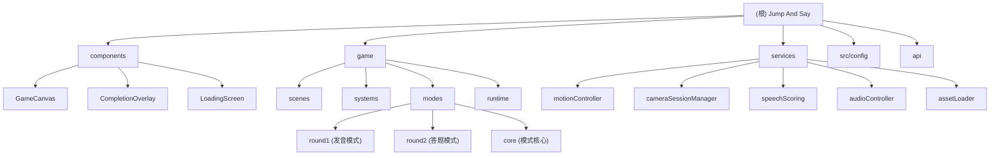

# Jump And Say - 项目文档

> 最后更新: 2026-03-29

## 项目愿景

Jump And Say 是一款基于体感识别的教育类游戏，结合了身体运动和语音学习。玩家通过肢体动作（跳跃、左右移动）与游戏互动，在完成跳跃答题和发音练习的过程中学习英语单词。

## 架构总览

本项目采用 **React + Phaser 3** 混合架构，通过 MediaPipe Pose 实现实时人体姿态识别，支持移动端和桌面端的 WebGL 渲染。

### 核心技术栈

- **前端框架**: React 18.3.1 + TypeScript 5.8.2
- **游戏引擎**: Phaser 3.80.0 (Arcade 物理引擎)
- **姿态识别**: MediaPipe Pose (Lite 模型)
- **构建工具**: Vite 6.2.0
- **PWA**: vite-plugin-pwa (Service Worker 离线支持)
- **CDN**: Cloudflare R2 (主题资源、字体、音频)
- **语音识别**: 浏览器原生 Speech Recognition API + 第三方 API (Deepgram/AssemblyAI) 兜底

### 渲染架构

```
React Application (UI 层)
    ├── App.tsx (主应用容器)
    ├── GameCanvas.tsx (Phaser 游戏容器)
    └── UI Components (LoadingScreen, CompletionOverlay 等)
        │
        └── Phaser Game (游戏逻辑层)
            ├── PreloadScene (资源预加载)
            └── MainScene (主游戏场景)
                ├── PlayerControlSystem (玩家控制系统)
                ├── CardSystem (卡片系统)
                ├── PronunciationSystem (发音系统)
                └── RewardSystem (奖励系统)
```

## 模块结构图



## 模块索引

| 模块路径 | 职责描述 | 入口文件 |
|---------|---------|---------|
| [`/components`](./components/CLAUDE.md) | React UI 组件，包含游戏容器、加载屏幕、完成界面等 | `GameCanvas.tsx` |
| [`/game`](./game/CLAUDE.md) | Phaser 游戏核心逻辑，包含场景、系统、游戏模式 | `scenes/MainScene.ts` |
| [`/services`](./services/CLAUDE.md) | 核心服务层，包含动作识别、摄像头管理、语音评分等 | `motionController.ts` |
| [`/src/config`](./src/config/CLAUDE.md) | 配置管理，R2 CDN 路径映射 | `r2Config.ts` |
| [`/api`](./api/CLAUDE.md) | 语音识别 API 接口（用于第三方 API 兜底） | `recognize.ts` |

## 运行与开发

### 开发环境启动

```bash
# 安装依赖
npm install

# 启动开发服务器 (HTTPS, 端口 3000)
npm run dev

# 在浏览器打开
open https://localhost:3000
```

### 生产构建

```bash
# 构建生产版本
npm run build

# 本地预览生产构建
npm run preview
```

### 测试

```bash
# 运行所有测试 (Node.js 内置测试运行器)
node --test

# 运行单个测试文件
node --test services/speechScoring.test.ts

# 运行匹配模式的测试
node --test --test-name-pattern="recognize"
```

### 环境变量

创建 `.env.local` 文件配置以下变量：

```env
VITE_R2_BASE_URL=https://cdn.maskmysheet.com/raz_aa
```

## 测试策略

### 测试框架

- **运行器**: Node.js 内置测试运行器 (`node --test`)
- **测试文件**: `*.test.ts` 后缀，位于对应模块目录

### 测试覆盖范围

- **语音评分**: `services/speechScoring.test.ts` - 测试语音识别结果处理
- **发音评估**: `services/pronunciationAssessment.test.ts` - 测试发音准确度算法
- **兜底识别器**: `services/fallbackRecognizer.test.ts` - 测试第三方 API 兜底逻辑
- **API 接口**: `api/recognize.test.ts` - 测试语音识别 API 接口

### 运行测试

```bash
# 完整测试套件
node --test services/*.test.ts api/*.test.ts

# 带详细输出
node --test --test-reporter=tap services/speechScoring.test.ts
```

## 编码规范

### TypeScript 规范

- **严格类型**: 所有函数参数和返回值必须显式类型声明
- **禁止 `any`**: 禁用 `as any` 和 `@ts-ignore`（第三方库除外）
- **枚举命名**: UPPER_SNAKE_CASE (`GamePhase.PLAYING`)
- **接口命名**: PascalCase (`MotionState`, `Theme`)

### 导入顺序

```typescript
// 1. 外部库
import Phaser from 'phaser';
import React, { useEffect, useState } from 'react';

// 2. 内部模块
import { GameCanvas } from './components/GameCanvas';

// 3. 类型导入
import type { ThemeId, GamePhase } from './types';
```

### 命名约定

- **组件**: PascalCase (`GameCanvas`, `CompletionOverlay`)
- **函数/方法**: camelCase (`handleScoreUpdate`, `initializeGame`)
- **类**: PascalCase (`MotionController`, `MainScene`)
- **常量**: UPPER_SNAKE_CASE (`MAX_CONCURRENT_DOWNLOADS`, `FRAME_MIN_TIME`)
- **私有字段**: 前缀 `_` 或 `private` 关键字

### React 模式

```typescript
export const GameCanvas: React.FC<GameCanvasProps> = ({ onScoreUpdate }) => {
  const gameRef = useRef<Phaser.Game | null>(null);

  useEffect(() => {
    // 初始化逻辑
    return () => {
      // 清理 Phaser 游戏实例
      game.destroy(true);
    };
  }, []);

  return <div ref={containerRef} className="w-full h-full" />;
};
```

### 错误处理

**禁止空 catch 块**，必须记录或处理错误：

```typescript
try {
  await motionController.start(videoRef.current!);
} catch (error) {
  console.error('[MotionController] start failed:', error);
  alert('启动动作识别失败，请刷新页面重试。');
}
```

### 日志规范

使用标签化日志：`[INIT]`, `[START]`, `[JUMP]`, `[Font]`, `[Audio]`, `[DIAG]`

```typescript
const LOG_LEVEL = { DEBUG: 0, INFO: 1, WARN: 2, ERROR: 3 };
const CURRENT_LOG_LEVEL = import.meta.env.DEV ? LOG_LEVEL.INFO : LOG_LEVEL.WARN;
```

## AI 使用指引

### 修改 Phaser 相关代码

在修改 Phaser 游戏引擎相关代码时，必须遵循 `phaser-doc-first` 技能：

1. **文档优先**: 实现前必须查阅 [Phaser 官方文档](https://docs.phaser.io/api-documentation/3.88.2/api-documentation)
2. **API 验证**: 代码变更需引用具体 API 章节
3. **示例格式**: "根据 Phaser 3.88.2 文档的 `Phaser.Physics.Arcade.Sprite` 章节..."

### 关键架构决策

1. **资源清理**
   - Phaser 游戏: `game.destroy(true)`
   - 摄像头流: `stream.getTracks().forEach(t => t.stop())`
   - 事件监听器: 在 `useEffect` 清理函数中移除
   - Audio Blob URL: 缓存驱逐时调用 `URL.revokeObjectURL()`

2. **移动端摄像头**
   - 设置 `videoElement.muted = true` 和 `playsInline` (iOS 兼容)
   - 设备约束: iPad 1280x720, 手机 640x480
   - 自适应配置文件: iOS/Android/HarmonyOS/桌面端

3. **PWA 缓存策略**
   - MediaPipe: `mediapipe-cdn-cache-v2` (1 年)
   - 主题图片: `raz-cdn-cache-v4` (1 年)
   - 游戏资源: `game-assets-cdn-cache-v3` (1 年)

4. **音频自动播放**
   - 播放前调用 `window.ensureAudioUnlocked()`
   - 使用捕获阶段监听器解锁音频上下文

5. **调试模式**
   - 开发环境自动启用 Eruda
   - 强制调试: URL 参数 `?debug=true` 或 `?diag=1`

## 关键配置文件

| 文件 | 用途 |
|------|------|
| `vite.config.ts` | Vite 构建配置、PWA 设置、CDN 代理 |
| `tsconfig.json` | TypeScript 编译选项 (ES2022, Phaser 兼容) |
| `package.json` | 依赖管理、脚本命令 |
| `.env.local` | 本地环境变量 (R2 CDN URL) |
| `manifest.json` | PWA 清单文件 |

## 开发工作流

### 新增游戏模式

1. 在 `game/modes/` 创建新模式目录
2. 实现 `GameplayModePlugin` 接口
3. 在 `game/runtime/ModeRegistry.ts` 注册模式
4. 更新 `types.ts` 中的 `GameplayMode` 类型

### 新增主题

1. 在 R2 CDN 的 `RAZ/` 目录上传主题资源
2. 更新 `public/themes/themes-list.json`
3. 运行 `npm run dev` 测试主题加载

### 调试姿态识别

1. 访问 `https://localhost:3000?diag=1`
2. 打开浏览器控制台查看 `[MotionController]` 日志
3. 检查 MediaPipe 加载状态 (`[MediaPipe Pose]`)

## 已知问题与限制

- **iOS 开发模式**: Service Worker 在 iOS 开发环境会被禁用，自动清理旧缓存
- **摄像头权限**: 某些安卓设备需要 HTTPS 才能访问摄像头
- **MediaPipe 加载**: 首次加载需要下载 ~5MB 模型文件，已配置多 CDN 兜底
- **音频自动播放**: 需要用户首次交互才能播放音频

## 变更记录 (Changelog)

### 2026-03-29 - 初始化架构师扫描

- 创建根级 `CLAUDE.md` 文档
- 创建模块级文档: `components/`, `game/`, `services/`, `src/config/`, `api/`
- 生成 `.claude/index.json` 索引文件
- 扫描覆盖率: 53 个 TS/TSX 文件，100% 覆盖
- 已识别 5 个主要模块，17 个子系统文件
