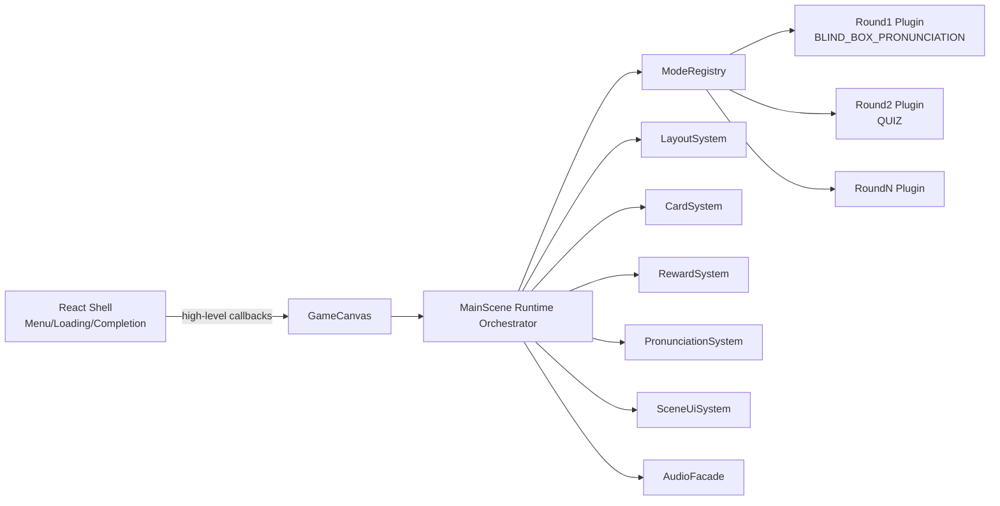

# Gameplay Mode Plugin Architecture Refactor Implementation Plan

> **For Claude:** REQUIRED SUB-SKILL: Use superpowers:executing-plans to implement this plan task-by-task.

**Goal:** 将当前 `MainScene` 的多玩法分支重构为“可插拔玩法模式 + 可复用系统层”，支持后续新增 round/玩法而不继续膨胀主场景复杂度。

## 0. 执行状态（2026-02-28）

1. ✅ 已新增 `modes/core`、`runtime`、`systems` 与 `round1/round2` 插件骨架。
2. ✅ `MainScene` 已接入 `ModeRegistry`，`update/resize/hitBlock` 统一转发到当前 mode。
3. ✅ 已新增 `safe fallback`（mode enter 失败自动回退到 `QUIZ`）。
4. ✅ React/Phaser 桥接已收敛，移除 `onGameRestart` 低层回调，仅保留高层状态回调。
5. ✅ 已提供 `game/modes/_template/NewModeTemplate.ts` 作为新玩法模板。
6. ✅ 已将主题初始化/完成回调与响应式布局策略接入插件钩子，减少 MainScene 模式分支。
7. ✅ 已提供运行时回滚开关：`?pluginRuntime=0|false|off`（后续已移除，插件运行时成为唯一路径）。
8. ✅ 已将 round1/round2 核心回合流程方法体迁移到 `Round1PronunciationFlow` / `Round2QuizFlow`，`MainScene.ts` 从 4007 行降到 3241 行（保留行为语义）。
9. ✅ 已将 round2 出题链路与 round1 音频/识别链路继续下沉到 flow，并清理未使用倒计时遗留代码，`MainScene.ts` 进一步降到 2962 行。
10. ✅ 已继续下沉 round1 判级/平均分汇总逻辑，并清理未使用的 `playPronunciationReward` 遗留实现，`MainScene.ts` 进一步降到 2800 行。
11. ✅ 已将 round1 结果反馈 UI（文案/徽章/反馈语音）迁入 `Round1PronunciationFlow`，`MainScene.ts` 进一步降到 2637 行。
12. ✅ 已将 round2 题目音频播放链路迁入 `Round2QuizFlow`，并将 round1 token/delay 辅助逻辑迁入 `Round1PronunciationFlow`，`MainScene.ts` 进一步降到 2569 行。
13. ✅ 已将 round1 盲盒布局/揭示布局算法迁入 `Round1PronunciationFlow`，`MainScene.ts` 进一步降到 2510 行。
14. ✅ 已将 round1 HUD/麦克风提示/音量监控/揭示 UI 清理链路迁入 `Round1PronunciationFlow`，`MainScene.ts` 进一步降到 2078 行。
15. ✅ 已将卡片响应式布局与方块重排逻辑下沉到 `CardSystem`，`MainScene` 去除 `applyRound1ResponsiveLayoutStrategy/applyRound2ResponsiveLayoutStrategy`。
16. ✅ 已将 round2 的答案键→贴图映射下沉到 `Round2QuizFlow`，并删除 `MainScene` 的 `getQuestionByAnswerKey/getImageTextureKeyByAnswer`。
17. ✅ 已将撞卡爆炸特效下沉到 `RewardSystem.playBlockExplosion`，并删除 `MainScene.createBlockExplosion`。
18. ✅ 已移除 `usePluginRuntime` legacy 分支与 `?pluginRuntime` 桥接参数，插件运行时成为唯一执行路径。
19. ✅ 已更新 `docs/WIKI.md` 与本计划状态，保持架构文档与实现一致。
20. ✅ 已将玩家控制主循环（含姿态/键盘跳跃、车道迟滞、纠偏）迁入 `PlayerControlSystem`，`MainScene.runLegacyUpdateLoop` 退化为薄委托。
21. ✅ 已将主题数据兜底与图片/音频缺失加载链路迁入 `ThemeAssetRuntime`，`MainScene` 保留最小入口方法。
22. ✅ 已将蜜蜂 UI 布局/文案更新与方块清理动画迁入 `SceneUiSystem`，`MainScene` 对应方法改为委托调用。
23. ✅ `MainScene.ts` 进一步从 1905 行降到 1490 行；构建验证通过（`vite build --emptyOutDir=false`）。

**Architecture:** 保留 `React` 作为壳层流程（菜单、加载、结算），将实时游戏内 UI 与玩法逻辑收敛到 Phaser。`MainScene` 退化为运行时编排器（Runtime Orchestrator），通过 `ModeRegistry` 驱动 `Round1/Round2/...` 插件，公共能力下沉为 `systems/` 模块供玩法复用。

**Tech Stack:** React 18, TypeScript 5.x, Phaser 3.80, MediaPipe Pose, Vite 6

---

## 1. 背景与重构动机（Why）

### 当前痛点

1. `MainScene.ts` 体量和职责过大（布局、物理、音频、识别、两种玩法、UI、场景切换混合在一起）。
2. 玩法通过 `if (sceneMode === ...)` 分支耦合，新增玩法会线性增加复杂度和回归风险。
3. React/Phaser 通信历史上过多，存在语义复用（例如字符串型事件承担多种含义）。
4. 一些能力在不同玩法中重复实现（奖励反馈、卡片生成、流程控制）。

### 已完成基线（本轮前置工作）

1. round1 实时 HUD（话筒、倒计时、音量条）已迁移到 Phaser。
2. round1 反馈素材动效（结果文案/反馈 badge）已迁移到 Phaser。
3. React 侧对应 HUD/反馈回调已收敛，通信通道已减少。

### 目标收益

1. 新增玩法时，只新增插件和少量注册代码，不修改核心大文件。
2. 公共能力沉淀后，玩法复用比例提升，开发速度更稳定。
3. 玩法回归范围局部化，故障隔离能力提高。
4. 为后续玩法增长（round3+）提供长期可维护结构。

---

## 2. 范围与非目标

### 范围（In Scope）

1. Phaser 玩法层的插件化重构。
2. `MainScene` 职责瘦身为运行时编排。
3. 公共系统抽取（布局、卡片、奖励、发音流程、游戏内 HUD）。
4. React/Phaser 通信协议收敛为少量高层事件。

### 非目标（Out of Scope）

1. 不重写现有玩法规则（保持当前行为语义）。
2. 不引入大型状态管理库（Redux/Zustand）到 Phaser 层。
3. 不在本期引入完整自动化 E2E 框架（当前仓库无测试框架基线）。

---

## 3. 目标架构



### 角色边界

1. React：非实时 UI 与应用壳层流程。
2. Phaser：实时游戏画面、玩法流程、实时反馈与动效。
3. MainScene：只做生命周期调度与 mode 切换，不直接写玩法细节。
4. Mode 插件：每个玩法独立实现 enter/update/exit 和碰撞处理。
5. Systems：玩法共享能力，避免重复实现。

---

## 4. 文件与目录规划

## 新增目录

1. `game/modes/core/`
2. `game/modes/round1/`
3. `game/modes/round2/`
4. `game/systems/`
5. `game/runtime/`

## 关键新增文件

1. `game/modes/core/types.ts`
2. `game/modes/core/GameplayModePlugin.ts`
3. `game/runtime/ModeRegistry.ts`
4. `game/runtime/SceneRuntimeState.ts`
5. `game/systems/SceneUiSystem.ts`
6. `game/systems/RewardSystem.ts`
7. `game/systems/CardSystem.ts`
8. `game/modes/round1/Round1PronunciationMode.ts`
9. `game/modes/round2/Round2QuizMode.ts`

## 关键改造文件

1. `game/scenes/MainScene.ts`
2. `components/GameCanvas.tsx`
3. `types.ts`（仅补玩法枚举与必要类型，不扩散到 React UI 状态）

---

## 5. 执行计划（分阶段）

## Task 1: 定义玩法插件契约与运行时上下文

**Files:**
- Create: `game/modes/core/types.ts`
- Create: `game/modes/core/GameplayModePlugin.ts`
- Create: `game/runtime/SceneRuntimeState.ts`
- Modify: `types.ts`

**Step 1: 定义玩法 ID 与上下文接口**

1. 新增 `GameplayModeId`、`ModeContext`、`ModeTransitionReason`。
2. `ModeContext` 仅暴露最小可用 API（scene/systems/state/callback bridges）。

**Step 2: 定义插件生命周期接口**

1. `enter`
2. `update`
3. `exit`
4. `onResize`
5. `onPlayerHitBlock`

**Step 3: 约束类型边界**

1. 禁止插件直接访问 React 层对象。
2. 保持 Phaser typed API，不使用 `as any` 扩散。

**Step 4: 编译验证**

Run: `npm run build`  
Expected: build 通过，无新增 TS 错误。

**Step 5: Commit**

```bash
git add game/modes/core game/runtime types.ts
git commit -m "refactor: introduce gameplay mode plugin contracts"
```

---

## Task 2: 抽取共享系统层（先抽不改行为）

**Files:**
- Create: `game/systems/SceneUiSystem.ts`
- Create: `game/systems/CardSystem.ts`
- Create: `game/systems/RewardSystem.ts`
- Create: `game/systems/PronunciationSystem.ts`
- Modify: `game/scenes/MainScene.ts`

**Step 1: 提取 UI 系统**

1. 将 round1 HUD 相关逻辑集中到 `SceneUiSystem`。
2. `MainScene` 仅调用 `uiSystem.show/hide/update`。

**Step 2: 提取卡片系统**

1. 抽离卡片构建、布局更新、销毁回收逻辑。
2. 保持现有卡片视觉与碰撞行为不变。

**Step 3: 提取奖励系统**

1. 抽离反馈 badge、奖励飞行、分数入账动画。
2. 保持与 score panel 对齐逻辑一致。

**Step 4: 提取发音流程系统**

1. 抽离录音窗口、音量监测、识别重试策略。
2. 返回标准化 `PronunciationRoundResult`。

**Step 5: 编译验证**

Run: `npm run build`  
Expected: build 通过，行为不变（人工 smoke 通过）。

**Step 6: Commit**

```bash
git add game/systems game/scenes/MainScene.ts
git commit -m "refactor: extract reusable phaser gameplay systems"
```

---

## Task 3: 引入 ModeRegistry 与运行时编排

**Files:**
- Create: `game/runtime/ModeRegistry.ts`
- Modify: `game/scenes/MainScene.ts`

**Step 1: 注册机制**

1. `register(modeId, plugin)`
2. `resolve(modeId)`
3. `switchMode(nextModeId, reason)`

**Step 2: MainScene 生命周期接管**

1. `init/create/update/resize/hitBlock` 转发到当前 mode。
2. 统一处理 `enter/exit` 异常兜底。

**Step 3: 状态与资源清理**

1. mode 切换必须触发 `exit`。
2. Scene shutdown/destroy 必须统一释放系统资源。

**Step 4: 编译验证**

Run: `npm run build`  
Expected: build 通过，模式切换无空指针。

**Step 5: Commit**

```bash
git add game/runtime game/scenes/MainScene.ts
git commit -m "refactor: add mode registry and runtime orchestration"
```

---

## Task 4: 落地 Round1 插件（发音盲盒）

**Files:**
- Create: `game/modes/round1/Round1PronunciationMode.ts`
- Modify: `game/scenes/MainScene.ts`

**Step 1: round1 逻辑搬迁**

1. 把 blind box 题目选择、播放、识别、重试、结算流程迁入插件。
2. MainScene 仅保留调用与状态桥接。

**Step 2: 接入共享系统**

1. `SceneUiSystem`
2. `CardSystem`
3. `RewardSystem`
4. `PronunciationSystem`

**Step 3: 保持外部回调协议**

1. `onScoreUpdate`
2. `onPronunciationProgressUpdate`
3. `onPronunciationComplete`
4. `onGameOver`

**Step 4: 验证**

Run: `npm run build`  
Manual:
1. Round1 进入后可正常撞卡与听读。  
2. 音量条/话筒/反馈素材正常。  
3. low confidence 可重试。  
4. 完成后可正常进入结算。

**Step 5: Commit**

```bash
git add game/modes/round1 game/scenes/MainScene.ts
git commit -m "refactor: move round1 pronunciation flow into plugin"
```

---

## Task 5: 落地 Round2 插件（听音识图）

**Files:**
- Create: `game/modes/round2/Round2QuizMode.ts`
- Modify: `game/scenes/MainScene.ts`

**Step 1: round2 逻辑搬迁**

1. 搬迁题目生成、干扰项、碰撞判定、奖励入账、下一题流程。

**Step 2: 复用共享系统**

1. 卡片渲染与布局来自 `CardSystem`。
2. 奖励反馈来自 `RewardSystem`。

**Step 3: 清理旧分支**

1. 删除 `sceneMode` 驱动的大分支主逻辑。
2. 保留轻量兼容层（必要时）。

**Step 4: 验证**

Run: `npm run build`  
Manual:
1. Round2 题目播放与碰撞答题正常。  
2. 分数、下一题、完成结算正常。  
3. 切回 round1 不受影响。

**Step 5: Commit**

```bash
git add game/modes/round2 game/scenes/MainScene.ts
git commit -m "refactor: move round2 quiz flow into plugin"
```

---

## Task 6: 收敛 React/Phaser 通信并做稳定性收尾

**Files:**
- Modify: `components/GameCanvas.tsx`
- Modify: `App.tsx`
- Modify: `game/scenes/MainScene.ts`

**Step 1: 通信白名单**

1. 仅保留高层事件：`score/progress/complete/gameOver/background`。
2. 禁止玩法细节通过字符串消息传递。

**Step 2: 清理过时桥接**

1. 清理无用 callbacks 与 registry 键。
2. 清理历史遗留 UI 兼容代码路径。

**Step 3: 异常与回滚点**

1. mode enter 失败回退到 safe mode（默认 round2）。
2. 输出明确日志标签便于线上诊断。

**Step 4: 验证**

Run: `npm run build`  
Manual:
1. Round1/Round2 全流程至少各跑 2 轮。  
2. 横竖屏切换与全屏切换布局稳定。  
3. 前后台切换后摄像头与音频恢复正常。

**Step 5: Commit**

```bash
git add components/GameCanvas.tsx App.tsx game/scenes/MainScene.ts
git commit -m "refactor: simplify react-phaser bridge for plugin runtime"
```

---

## Task 7: 文档化与新玩法模板

**Files:**
- Create: `game/modes/_template/NewModeTemplate.ts`
- Modify: `docs/WIKI.md`
- Create: `docs/plans/2026-02-28-gameplay-mode-plugin-refactor.md` (this file, keep updated)

**Step 1: 新玩法模板**

1. 提供最小可运行插件模板。
2. 写清 enter/update/exit 和系统依赖示例。

**Step 2: 项目文档更新**

1. 更新架构章节、通信边界、玩法扩展步骤。

**Step 3: 验证**

Run: `npm run build`  
Expected: 无类型回归。

**Step 4: Commit**

```bash
git add game/modes/_template docs/WIKI.md docs/plans/2026-02-28-gameplay-mode-plugin-refactor.md
git commit -m "docs: add gameplay mode plugin architecture and templates"
```

---

## 6. 验收标准（Definition of Done）

1. `MainScene.ts` 不再承载完整玩法业务流程，只做运行时编排。
2. round1 与 round2 均以插件模式运行，且行为与现网一致。
3. 新增玩法只需新增 `mode` 文件并注册，核心文件改动控制在小范围。
4. React/Phaser 通信仅保留高层状态，不含玩法细节字符串协议。
5. `npm run build` 持续通过；人工回归 checklist 全部通过。

---

## 7. 风险与回滚

### 主要风险

1. 大量函数迁移导致行为细微偏差。
2. Mode 切换期间清理不彻底造成残留 tween/timer/audio。
3. HUD/动画锚点在不同设备比例下出现偏移。

### 缓解策略

1. 先抽系统后迁玩法，分阶段逐步落地，避免一次性大爆改。
2. 每阶段都跑 build + 手工 smoke，发现偏差及时止损。
3. 通过 `ModeRegistry` fallback + 分任务提交控制回滚粒度，不再依赖 legacy runtime feature flag。

### 回滚方案

1. 以任务为单位提交，任一阶段可通过 `git revert <commit>` 回滚。
2. 生产问题优先回退到上一个稳定 commit，再定位具体 mode/system 问题。

---

## 8. 手工回归清单（无自动测试基线）

1. Round1：撞卡、播音、录音、音量条、反馈素材、重试、积分、结算。
2. Round2：听音、撞卡判定、奖励飞行、计分、结算。
3. 场景切换：菜单 -> 加载 -> 教学 -> 游戏 -> 结算 -> 下一轮。
4. 生命周期：切后台再回来、全屏切换、横竖屏变化。
5. 设备覆盖：iPad、Android 手机、桌面浏览器。

---

## 9. 里程碑建议

1. M1（1-2 天）：Task 1-2 完成（契约 + 系统抽取）。
2. M2（2-3 天）：Task 3-5 完成（运行时 + 两个插件落地）。
3. M3（1 天）：Task 6-7 完成（通信收敛 + 文档模板 + 收尾）。
